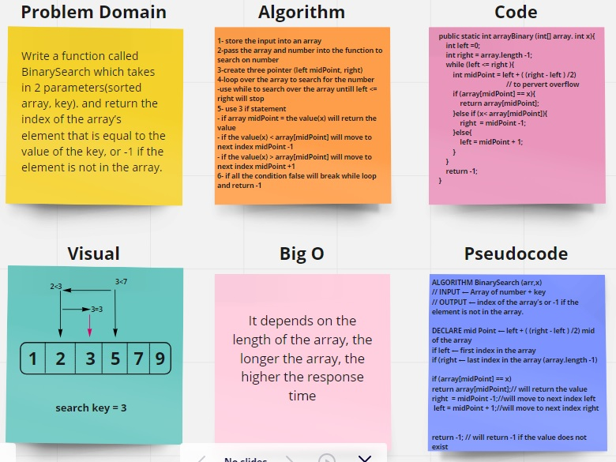

# Reverse an Array

Write a function called BinarySearch:

which takes in 2 parameters(sorted array, key). and return the index of the array’s element that is equal to the value of the key, or -1 if the element is not in the array.

## Whiteboard Process

## Approach & Efficiency

loop over the array to search for the number and use while to search over the array

i use 3 if statement
- if array midPoint = the value(x) will return the value
- if the value(x) < array[midPoint] will move to next index midPoint -1
- if the value(x) > array[midPoint] will move to next index midPoint +1

if all the condition false will break while loop and return -1

