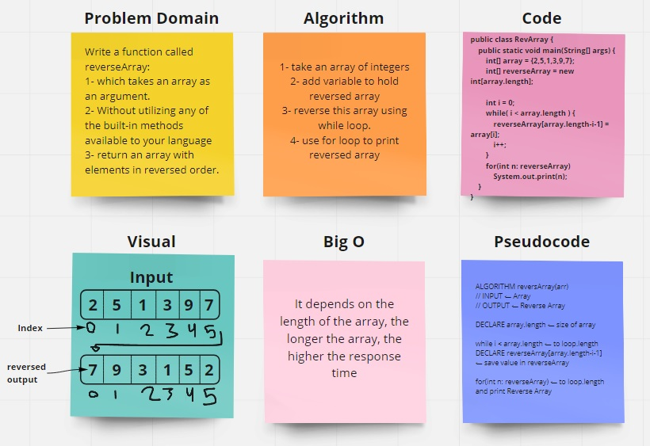

# Reverse an Array

Write a function called reverseArray:

1- which takes an array as an argument.

2- Without utilizing any of the built-in methods available to your language

3- return an array with elements in reversed order.

## Whiteboard Process

## Approach & Efficiency

i use while loop to reverse the array => while( i < array.length ) .

after that i add variable to hold reversed array

In the next step is store the value reversed using => reverseArray[array.length-i-1] = array[i];