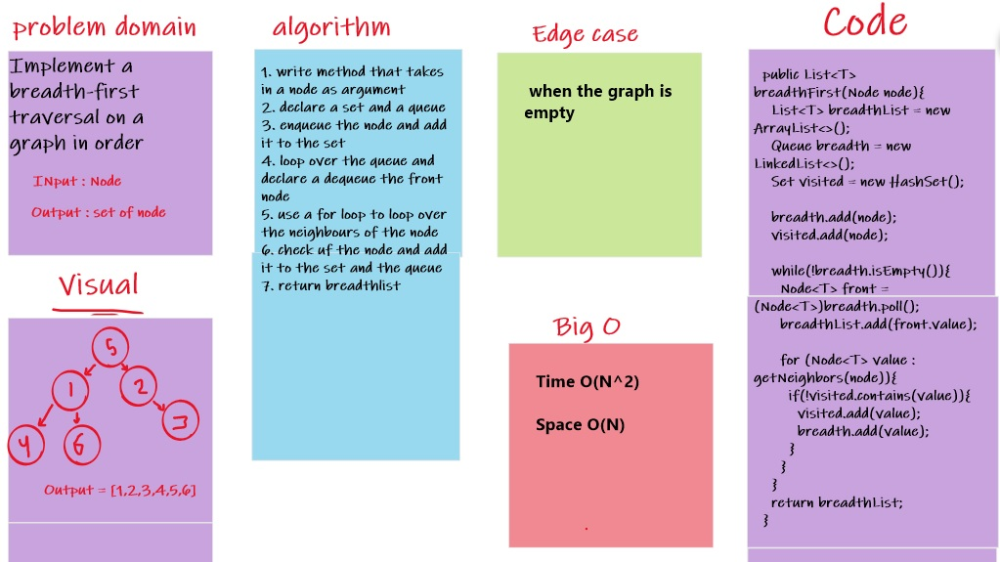

# Graphs [Code 35]

* Implement your own Graph. The graph should be represented as an adjacency list, and should include the following methods

## Approach & Efficiency
    
* add node
    * Arguments: value
    * Returns: The added node
    * Add a node to the graph

* add edge
    * Arguments: 2 nodes to be connected by the edge, weight (optional)
    * Returns: nothing
    * Adds a new edge between two nodes in the graph
    * If specified, assign a weight to the edge
    * Both nodes should already be in the Graph

* get nodes
    * Arguments: none
    * Returns all of the nodes in the graph as a collection (set, list, or similar)

 * get neighbors
    * Arguments: node
    * Returns a collection of edges connected to the given node
    * Include the weight of the connection in the returned collection

* size
    * Arguments: none
    * Returns the total number of nodes in the graph

------------------------------------------------------------------------------------------------
* add node : time = O(1) because we didnt use loops, space = O(n) because we declared a new ArrayList.
* add edge : time = O(1) because we didnt use loops, space = O(1) because we didnt declare any arrays.
* get nodes : time = O(n) because we use loop , space = O(n) because we declared a HashSet.
* get neighbors : O(1) for both time and space complexity because there is no loops or arrays.
* size : O(1) for both time and space complexity.

# breadth-first traversal on a graph [Code 36]

# Challenge Summary

write a function which traverse a graph by breadth first concept , and return a list of all the nodes traversed.

## Whiteboard Process

## Approach & Efficiency

time : O(n^2) `nested loop`

scape : O(n) `create new list and Set`