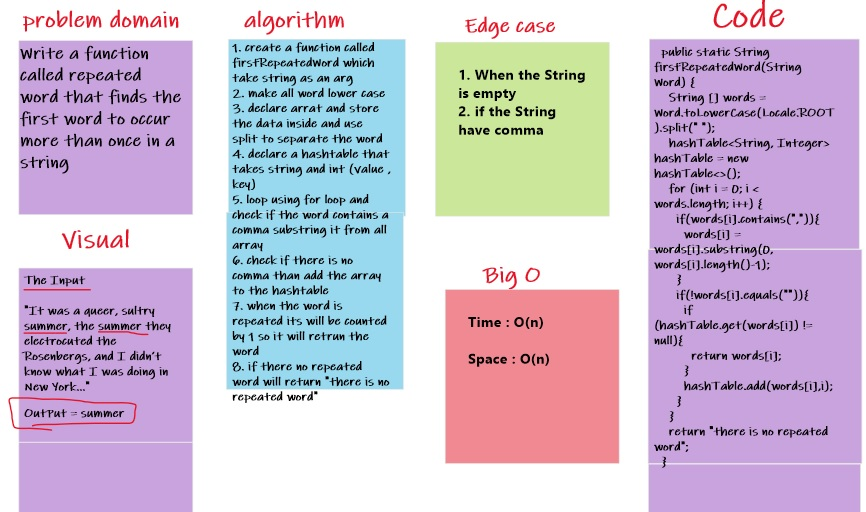
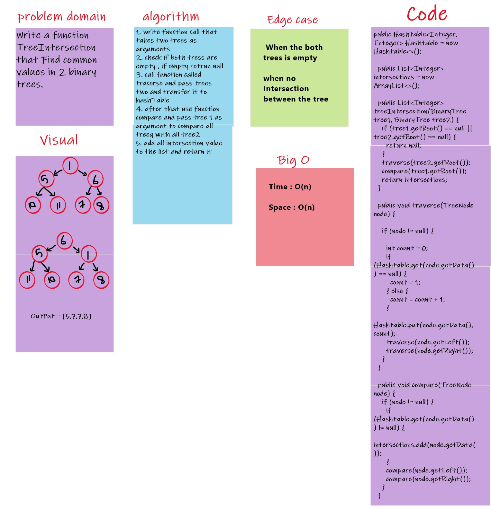

# Hash Tables

## Hashtables
Hash is the output of an operation of converting a string value to a value that could be used for either security or some other purpose.

## Challenge

Implement a Hashtable Class with the following methods:

* add
Arguments: key, value
Returns: nothing
This method should hash the key, and add the key and value pair to the table, handling collisions as needed.
* get
Arguments: key
Returns: Value associated with that key in the table
* contains
Arguments: key
Returns: Boolean, indicating if the key exists in the table already.
* hash
Arguments: key
Returns: Index in the collection for that key

## Approach & Efficiency

* add() and HashTable():
Time: BigO(n), Space: BigO(n)
* get():
 Time: BigO(n), Space: BigO(1)
* getHash()and contains():
 Time: BigO(1), Space: BigO(1)

## API

1. add(key, value): hash the key and add the key and the value to the table.

2. HashTable(size): generate hash by the key and return hash with the key

3. get(key): return the value for the key.

4. hash(key): return the index of the key.

5. contains(key): check if the key exist in the hash table.

# Challenge Summary
Write a function called repeated word that finds the first word to occur more than once in a string

## Whiteboard Process

## Approach & Efficiency

Time : O(n)

Space : O(n)

## Repeated Word

# Challenge Summary
Write a function called repeated word that finds the first word to occur more than once in a string

## Whiteboard Process

## Approach & Efficiency

Time : O(n)

Space : O(n)

## Tree Intersection

# Challenge Summary
Write a function TreeIntersection  that Find common values in 2 binary trees.

## Whiteboard Process

## Approach & Efficiency

Time : O(n)

Space : O(n)

