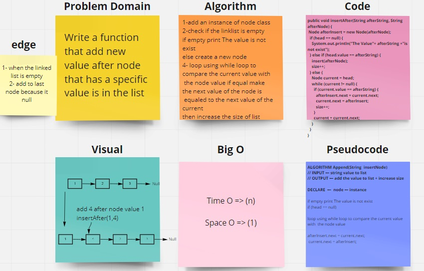
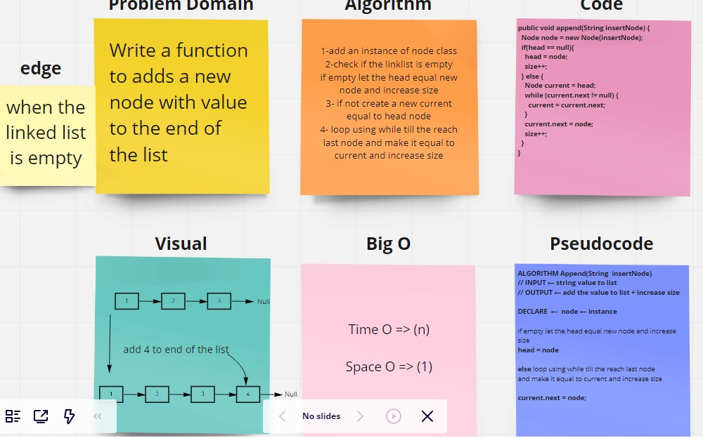
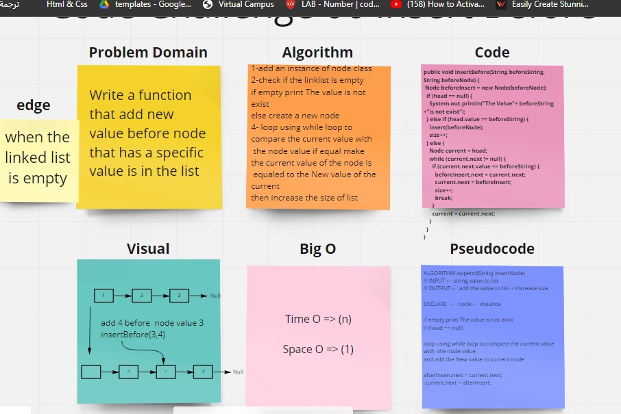
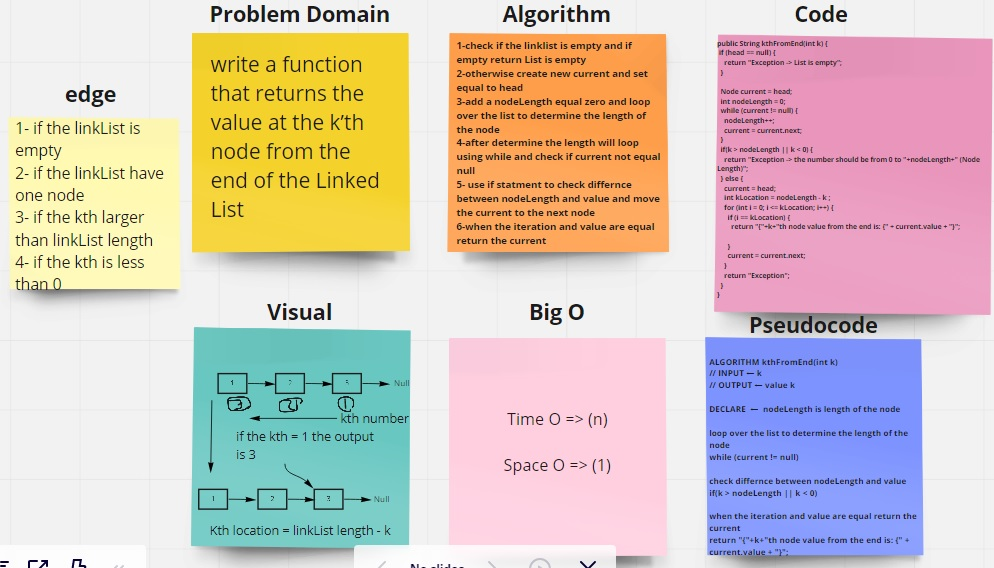
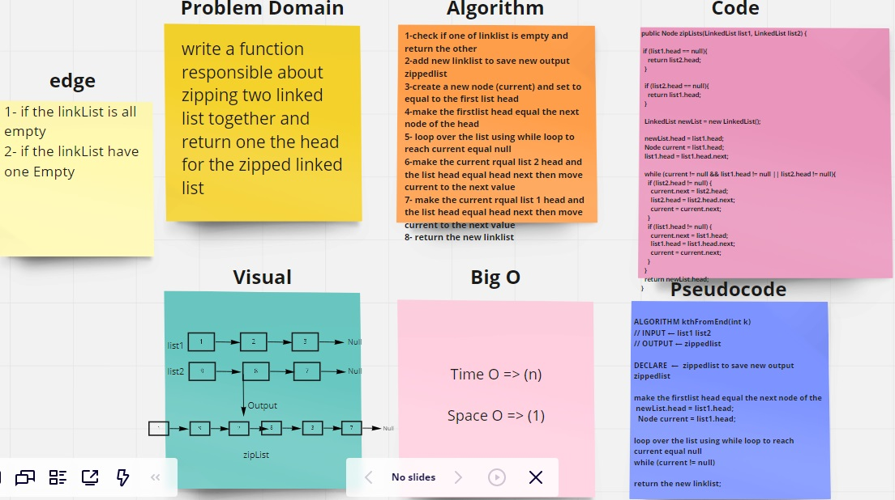

# Singly Linked List
it can be traversed in only one direction from head to the last node (NEXT)

## Challenge

Create a LinkedList :

1- Create a Node class

2- Create a LinkedList class.

The methods :

1- Insert values to the LinkedList.

2- Check If the value exists in the LinkedList or not.

3- Print out the values of nodes following this format "{ a } -> { b } -> { c } -> NULL".

## Approach & Efficiency

Insert: Takes an integer and creates a new node in the linked list that holds that value.

Includes:  loop throw the linked list using current pointer and check if the value of node mathces the value that has been passed as argument

toString: Returns a string containing all the values of the nodes of the linked list.

big o

time o(n) space o(n)

<!-- Lab 6 -->

# Challenge Summary
Write a function that add new value :
1- that add new value after node that has a specific value is in the list (insertAfter)

2- that add new value before node that has a specific value is in the list (insertBefore)

3- adds a new node with value to the end of the list (append)

## Whiteboard Process

## Approach & Efficiency

### Append
1-add an instance of node class

2-check if the linklist is empty

if empty let the head equal new node and increase size

3- if not create a new current equal to head node

4- loop using while till the reach last node and make it equal to current and increase size

### insert Before

1-add an instance of node class

2-check if the linklist is empty

if empty print The value is not exist
else create a new node

4- loop using while loop to compare the current value with
 the node value if equal make the current value of the node is
 equaled to the New value of the current
then increase the size of list

### insert After

1-add an instance of node class

2-check if the linklist is empty

if empty print The value is not exist
else create a new node

4- loop using while loop to compare the current value with
 the node value if equal make the next value of the node is
 equaled to the next value of the current
then increase the size of list

<!-- Lab 7 -->

# Challenge Summary
write a function that returns the value at the k’th node from the end of the Linked List

## Whiteboard Process

## Approach & Efficiency
while loop to iterate over the linked list nodes
the complexity:
time :O(N)
Space :O(1)

<!-- Lab 8 -->

# Challenge Summary
write a function that responsible about zipping two linked list together and return one the head for the zipped linked list

## Whiteboard Process

## Approach & Efficiency
while loop to iterate over the linked list nodes
the complexity:
time :O(N)
Space :O(1)

