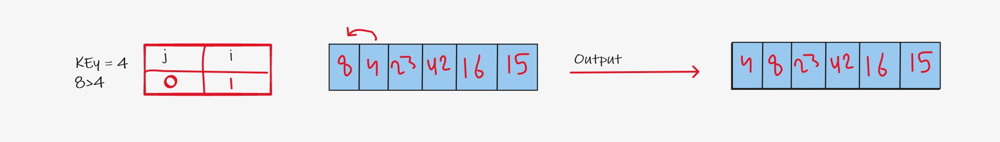
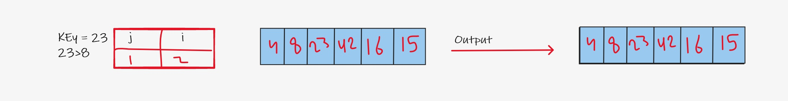
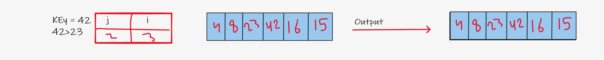
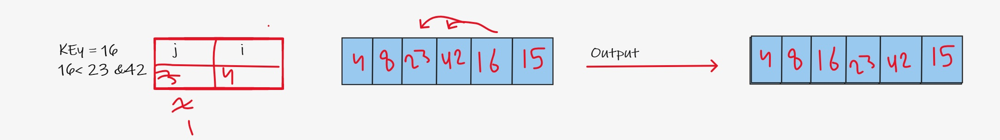
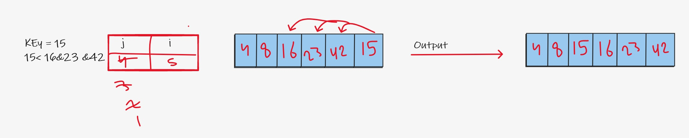

# Insertion Sort Blog

Insertion sort is the sorting mechanism where the sorted array is built having one item at a time.

### Pseudocode:

```
SelectionSort(int[] arr)
    DECLARE n <-- arr.Length;
    FOR i = 0; i to n - 1
        DECLARE min <-- i;
        FOR j = i + 1 to n
            if (arr[j] < arr[min])
                min <-- j;

        DECLARE key <-- arr[min];
        arr[min] <-- arr[i];
        arr[i] <-- key;
```

### Trace:

Array: [8,4,23,42,16,15]

Note : loop start from index 1 not 0 => i=1

**Step 1 :**



1. Start looping from index 1
2. compare key = 4 to j =0 nearby Index
3. 8 larger than 4
4. shift 4 one position to the left
5. set the key in position and go to the next iteration.

**Step 2 :**



1. set index = 2 will be key = 23
2. compare key = 23 to j =1 nearby Index will be 8
3. 23 larger than 8 so no need for shift any element and no need to continue comparing

**Step 3 :**



1. set index = 3 will be key = 42
2. compare key = 42 to j =2 nearby Index will be 23
3. 42 larger than 23 so no need for shift any element and no need to continue comparing

**Step 4 :**



1. set index = 4 will be key = 16
2. compare the key=16 which all previous elements which are this step 42, 23, 8, 4.
3. 42 larger than 16 then shift 16 one position to the left.
4. 23 larger than 16 then shift 16 one position to the left.
5. 16 larger than 8 so no need for shift any element and no need to continue comparing
6. set the key in position and go to the next iteration.

**Step 5 :**



1. set index = 5 will be key = 15
2. compare the key=16 which all previous elements which are this step 42, 23, 8, 4,16.
3. 42 larger than 16 then shift 16 one position to the left.
4. 23 larger than 16 then shift 16 one position to the left.
5. 16 larger than 15 then shift 16 one position to the left.
6. 15 larger than 8 so no need for shift any element and no need to continue comparing.
7. set the key in position and go to the next iteration.


**Output**
The output array will be: [4,8,15,16,23,42]

### Efficiency:

1. Time: O(n^2) The basic operation of this algorithm is comparison.
2. Space: O(1) No additional space is being created.
