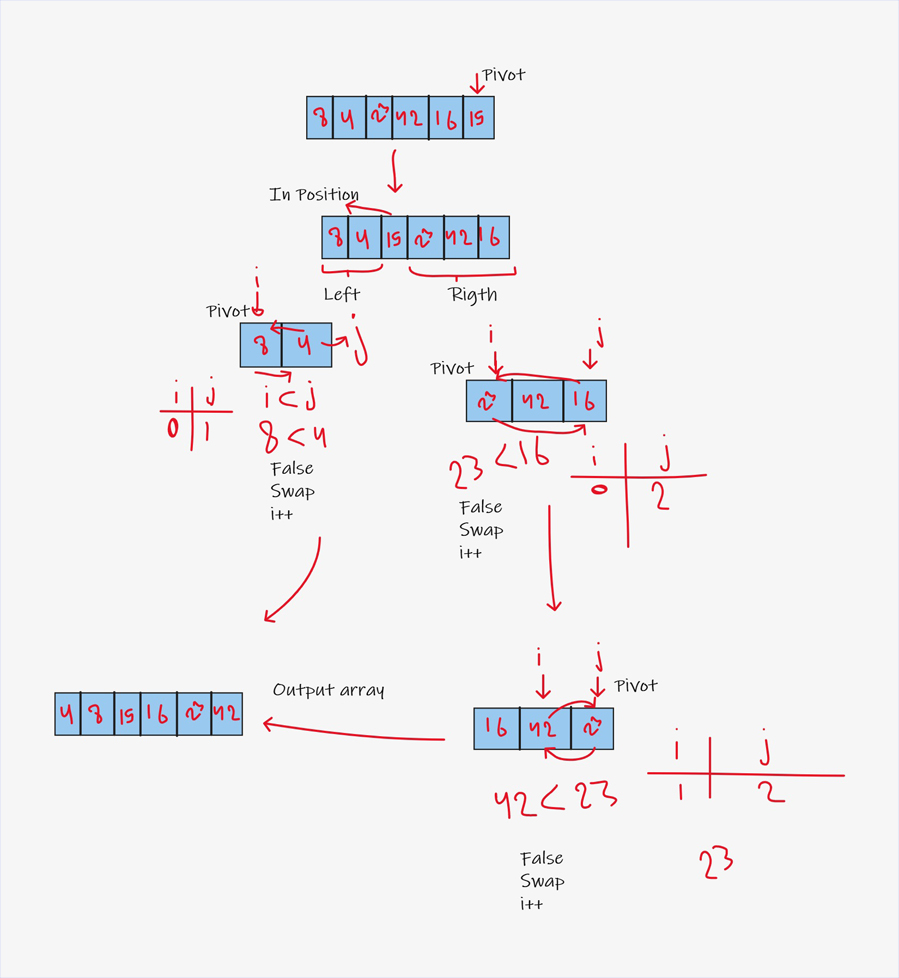
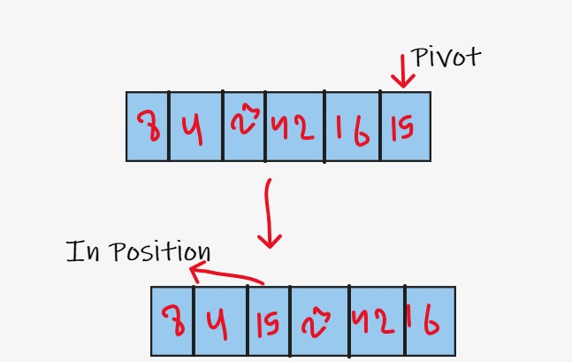
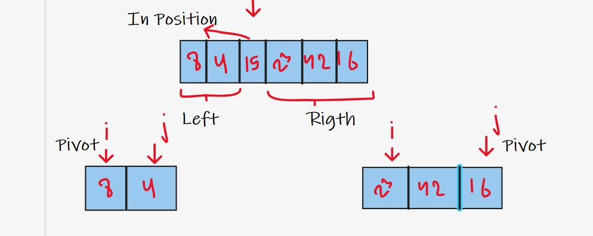
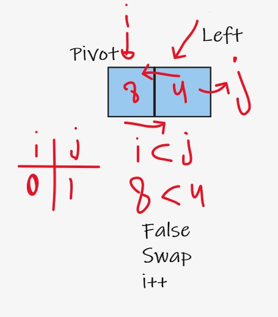
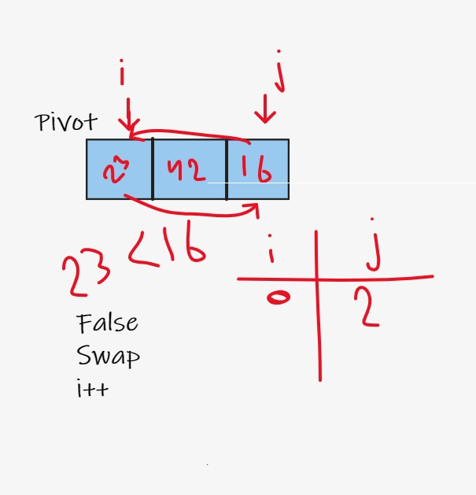
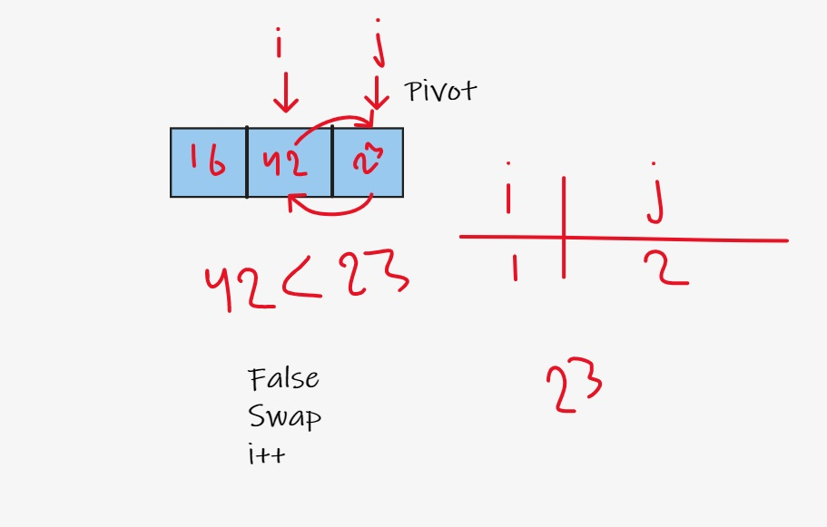

# Quick Sort Sort Blog

QuickSort is a Divide and Conquer algorithm. It picks an element as pivot and partitions the given array around the picked pivot.

### Pseudocode:

```
ALGORITHM QuickSort(arr, left, right)
    if left < right
        // Partition the array by setting the position of the pivot value
        DEFINE position <-- Partition(arr, left, right)
        // Sort the left
        QuickSort(arr, left, position - 1)
        // Sort the right
        QuickSort(arr, position + 1, right)

ALGORITHM Partition(arr, left, right)
    // set a pivot value as a point of reference
    DEFINE pivot <-- arr[right]
    // create a variable to track the largest index of numbers lower than the defined pivot
    DEFINE low <-- left - 1
    for i <- left to right do
        if arr[i] <= pivot
            low++
            Swap(arr, i, low)

     // place the value of the pivot location in the middle.
     // all numbers smaller than the pivot are on the left, larger on the right.
     Swap(arr, right, low + 1)
    // return the pivot index point
     return low + 1

ALGORITHM Swap(arr, i, low)
    DEFINE temp;
    temp <-- arr[i]
    arr[i] <-- arr[low]
    arr[low] <-- temp

```

### Trace:

Array: [8,4,23,42,16,15]




**Step 1 :**



in the first step we choose pivot and sort the number
all number smaller than 15 will go to left
and all number larger than 15 will go to right

**Step 2 :**



Then we deal with the left side in which the small numbers are located separately from the right side in which the large numbers are present
And number 15 does not change because it is in the correct position

**Step 3 :**



in the left side we will check if i smaller than j
and here the i = 8 and j = 4 (8<4) false
we swap between the numbers
and the left side sort now

**Step 4 :**



in the right side we will check if i smaller than j
and here the i = 23 and j = 16 (23<16) false
we swap between the numbers
and we will add +1 to i (i++) to move in the next elemnt

**Step 5 :**



in the right side we will check if i smaller than j
and here the i = 42 and j = 23 (42<23) false
we swap between the numbers
and the rigth side sort now


### Efficiency:

Time: O(n*Log(n)) We split each sub array into 2, which takes in half the length each time and this adds log(n) into the complexity.

Space: O(1) We didn't use any additional space in the memory.


