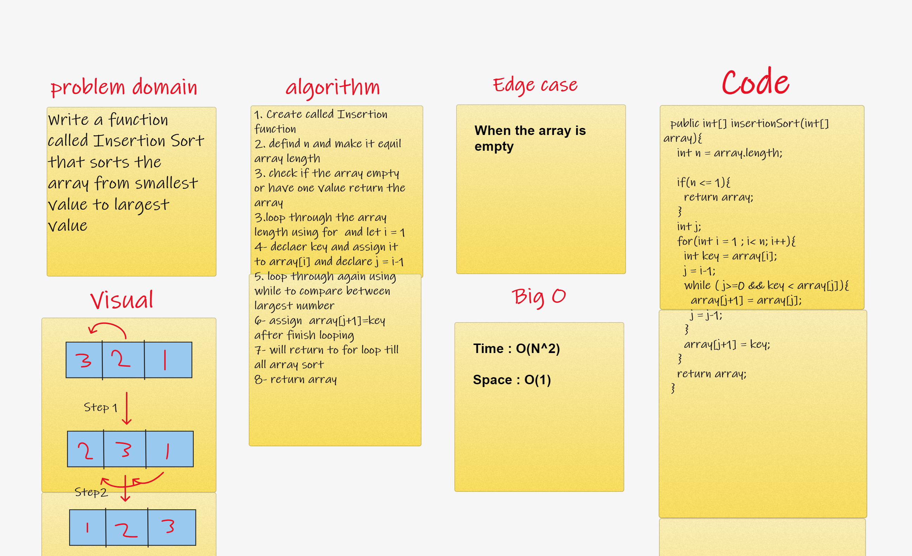
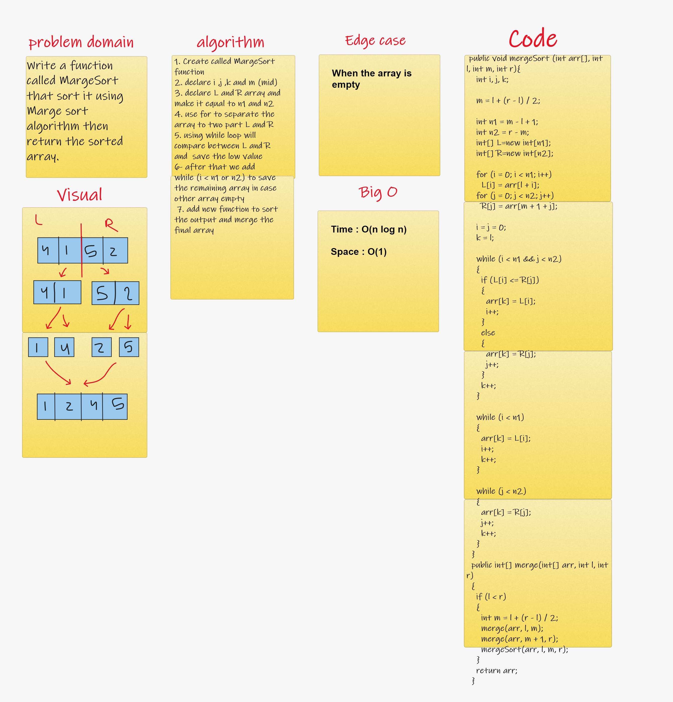

# Insertion Sort (code 26)

# Challenge Summary
Write a function called Insertion Sort that sorts the array from smallest value to largest value

## Whiteboard Process

## Approach & Efficiency

Time : O(N^2)
Space : O(1)

We do a loop twice
First loop : using for loop checking the elements behind it every iteration until the end of the array.
Second loop : using while loop to compare between 2 vlaue and get the largest number.

# MergeSort (code 27)

# Challenge Summary

Merge Sort is a Divide and Conquer algorithm. It divides the input array into two halves, calls itself for the two halves, and then merges the two sorted halves

## Whiteboard Process

## Approach & Efficiency

Time : O(n log n)
Space : O(1)

