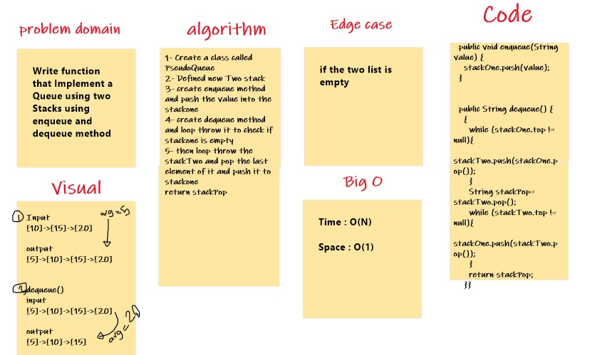
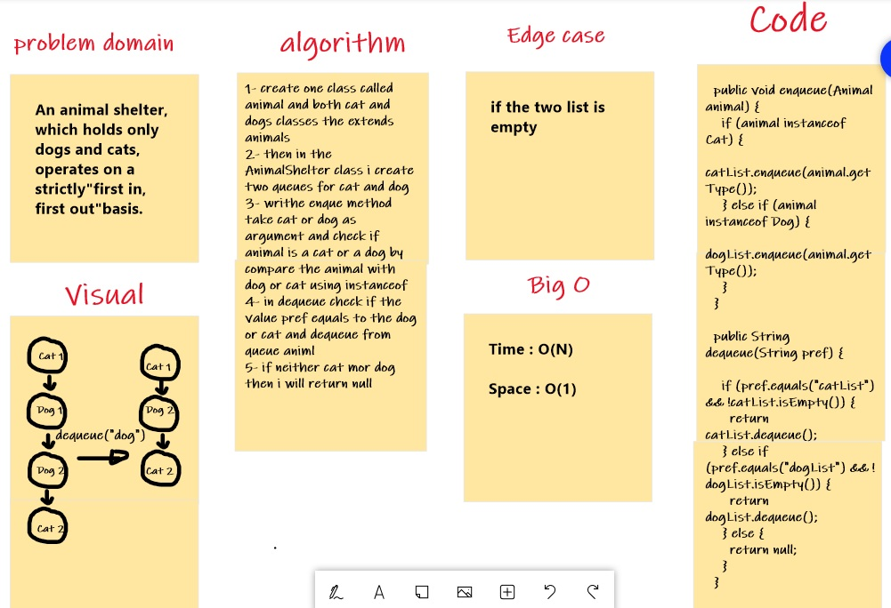
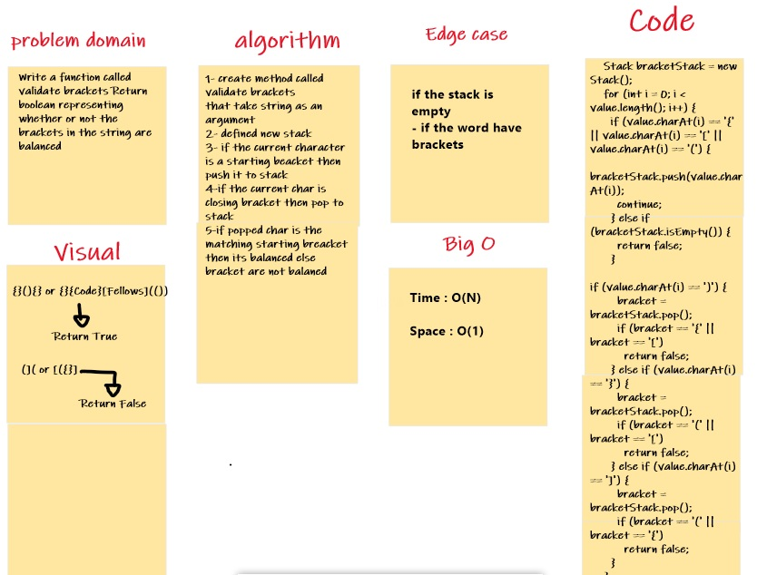

# Stacks and Queues Lab 10

Stack : used to store data in a last in first out format, meaning that the last item added onto the stack is the first item that will be removed from it.

Queue : In the queue only two operations are allowed enqueue and dequeue. Enqueue means to insert an item into the back of the queue, dequeue means removing the front item.


## Challenge
This challenge about how to build and using the Stack and Queue to store nodes in it.

The Stack class should contain the following methods:

1. pop
2. push
3. peek
4. isEmpty

The queue class should contain the following methods:

1. enqueue
2. dequeue
3. peek
4. isEmpty


## Approach & Efficiency

For all method Time: O(1) and Space: O(1)

## API

stack are:

1. Push adds an element at the top of a stack.
2. Pop removes the topmost element of a stack
3. The peek() method returns the element on the top of the stack but does not remove it.
4. The empty() method returns true if the stack is empty, otherwise, it returns false.

Queues are:

1. Enqueue : this method adds an element to the end/rear of the queue
2. Dequeue : this method removes an element from the front of the queue
3. Peek : This function returns the value of the topmost element available in the stack.
4. IsEmpty : If the stack is empty, then this function will return a true value or else it will return a false value.

# PseudoQueue  Lab 11

# Challenge Summary
Implement a Queue using two Stacks using enqueue and dequeue method

## Whiteboard Process


## Approach & Efficiency

For all method Time:

Time : O(N)
Space : O(1)

## Solution

```
  public void enqueue(String value) {
    stackOne.push(value);
  }


  public String dequeue() {
    {
      while (stackOne.top != null){
        stackTwo.push(stackOne.pop());
      }
      String stackPop= stackTwo.pop();
      while (stackTwo.top != null){
        stackOne.push(stackTwo.pop());
      }
      return stackPop;
    }}
```

# AnimalShelter  Lab 12

# Challenge Summary
An animal shelter, which holds only dogs and cats, operates on a strictly"first in, first out" basis
and will receive the oldest animal of that type

## Whiteboard Process


## Approach & Efficiency

Time : O(N)
Space : O(1)

enqueue(Animal):
Will act the same ad the enqueue method of the queue which we already have.

dequeue(pref):
in dequeue check if the value pref equals to the dog or cat and dequeue from queue animl
if neither cat mor dog then i will return null

# Stack Queue Brackets  Lab 13

# Challenge Summary
Write a function called validate brackets Return true or false representing whether or not the brackets in the string are balanced

## Whiteboard Process


## Approach & Efficiency

Time : O(N)
Space : O(1)

using for loop and if  the current character is a open beacket then push it to stack
if the current char is closing bracket then pop to stack


