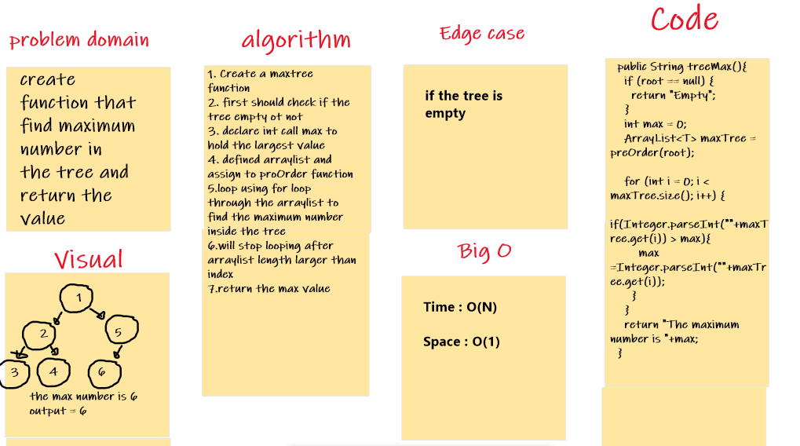
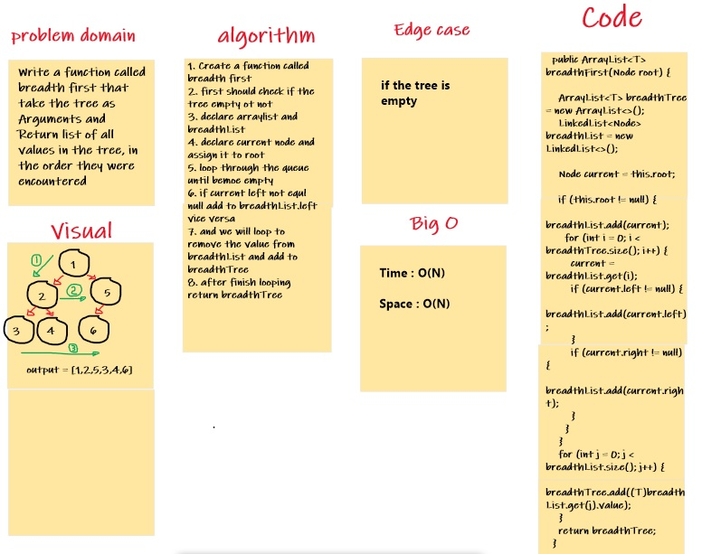
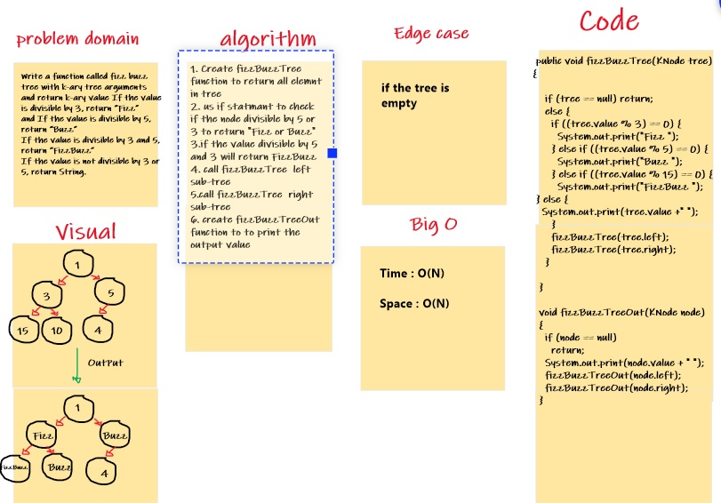

## Tree  Lab 15

# Challenge Summary

1. Create a BinaryTree class

Define a method for each of the depth first traversals called, preOrder, inOrder, and postOrder which returns an array of the values, ordered appropriately

2. Create a BinarySearchTree class

* Define a method named add that accepts a value, and adds a new node with that value in the correct location in the binary search tree.
* Define a method named contains that accepts a value, and returns a boolean indicating whether or not the value is in the tree at least once.

## Approach & Efficiency

1. For (pre order , in order , post order)

O(n) for the time and the space

2. For (Add  , Contains )
   O(n) for the time and the space

## tree-max Lab 16

# Challenge Summary
create function that find maximum number in the tree and return the value

## Whiteboard Process


## Approach & Efficiency

Time : O(N)
Space : O(1)

## Solution
```
public String treeMax(){
if (root == null) {
return "Empty";
}
int max = 0;
ArrayList<T> maxTree = preOrder(root);

    for (int i = 0; i < maxTree.size(); i++) {
      if(Integer.parseInt(""+maxTree.get(i)) > max){
        max =Integer.parseInt(""+maxTree.get(i));
      }
    }
    return "The maximum number is "+max;
}

```

## tree breadth first Lab 17

# Challenge Summary
Write a function called breadth first that take the tree as Arguments and Return list of all values in the tree, in the order they were encountered

## Whiteboard Process


## Approach & Efficiency

Time : O(N)
Space : O(N)

## tree-fizz-buzz Lab 18

# Challenge Summary
Write a function called fizz buzz tree with k-ary tree arguments
and return k-ary value If the value is divisible by 3, return “Fizz”
and If the value is divisible by 5, return “Buzz”
If the value is divisible by 3 and 5, return “FizzBuzz”
If the value is not divisible by 3 or 5, return String.

## Whiteboard Process


## Approach & Efficiency

Time : O(N)
Space : O(N)

us if statmant to check if the node divisible by 5 or 3 to return "Fizz or Buzz"
if the value divisible by 5 and 3 will return FizzBuzz


